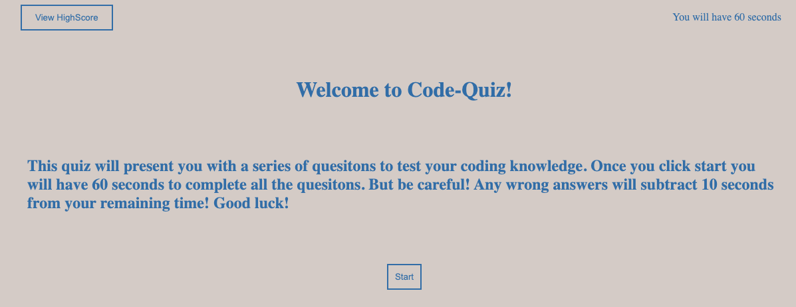
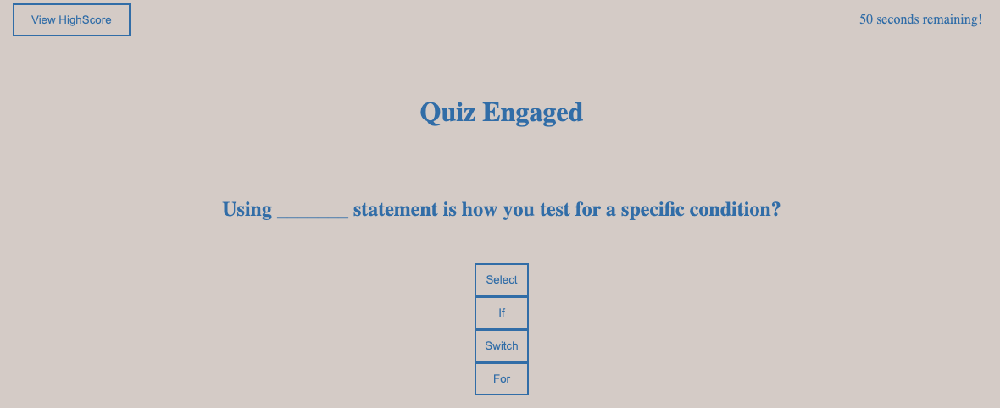
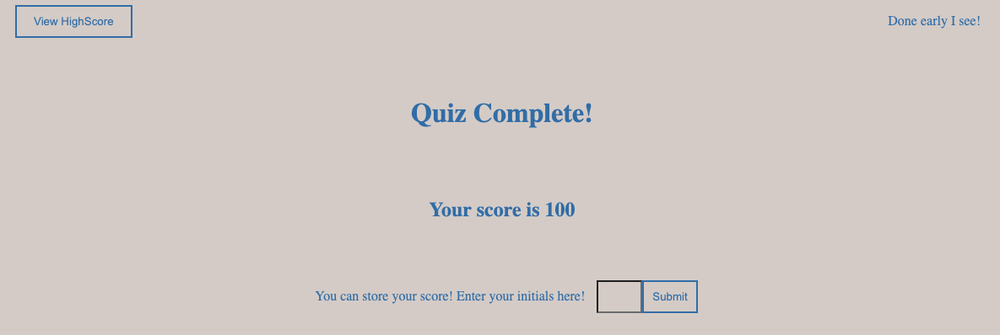
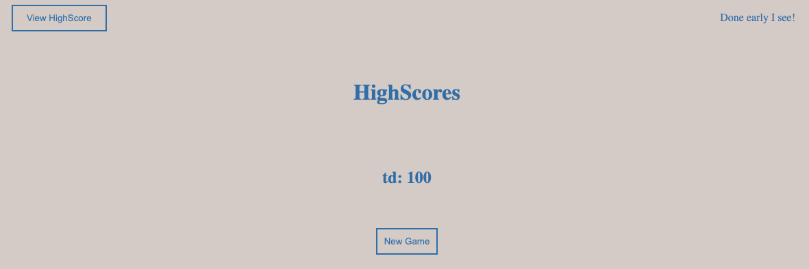

# Code Quiz

## Goals
The purpose of this project was to develop a web API so that a user could take a coding related quiz. This project could use HTML and CSS but the intention was to primarily rely on JavaScritp without the use of external libraries. The game would be considered complete once the following criteria were met.

- A start button is used to beging the quiz which will display a question as well as start a timer. 
- Once a question is answered, then another will be presented.
- If a question is answered incorrectly, a time penalty will be assesed. 
- When the timer ends or the quiz is complete, the game will end.
- Finally, the user will be able to store their name and score. 

## Description 

I began by setting the basic structure of the HTML. As the project was to be mostly JS, I kept this portion limitied and relied on JS methods to create many of the required elements. I determined to set a timer to 60 seconds that would run at a regular 1 second interval. 

Then, I set the opening stage for the quiz, styling the page so that a user would be able to know what was needed and be able to start the quiz. This will be the initial styling upon load as well as when a new game is initiated. 

I created two arrays, one for my questions and on for the potential answers. Using query selectors and `.textcontet` I inserted the first quesion and then used a `forEach` loop to iterate over the response array. This loop generated buttons with an `eventListener` for the corresponding potential responses. The users selection would trigger the next function to review the answers. Due to the limited questions, I checked for correctness against the correect answer strings, increasing the score if right or decreasing time if wrong. I then sent the user to the next position in the answer array until all questions had been answered. 

Once all questions were completed or if the timer hit zero the game ends and the users score is displayed along with an input field to save the score with the user initials. 

These values are stored in local storage and pushed to arrays so that they can be displayed once the game is over or the View Highscore button is cliked. 

Thank you for checking out this project. You can try the quiz here: https://traveye.github.io/Code-Quiz/

## Instalation
NA

## Usage
NA

## Credits
NA

## License
MIT

